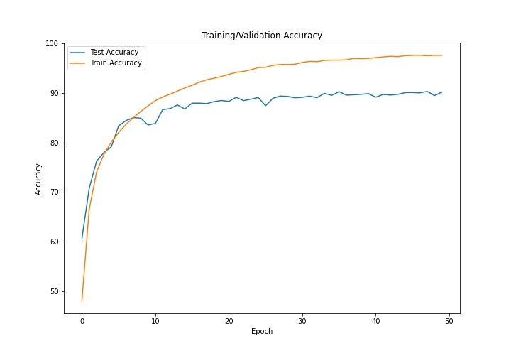

# EVA-4

## ASSIGNMENT-10

Done by- Adithya Balakumar, Akshay V M

1. Added CutOut to the code.
2. Implemented LR Finder (for SGD)
3. Implemented ReduceLROnPlatea
4. Find best LR to train your model

Target- 88% Accuracy.

Best Training Accuracy- 97.61%.

Best Test Accuracy- 90.30%.

## Training and Testing Accuracy Plot

## Link to Misclassified Images: 
https://drive.google.com/drive/folders/1QMFj3aG6oAA2GV3L6GUzN3A9aH0p6-sc?usp=sharing

## Link to GradCAM on Misclassified Images: 
https://drive.google.com/drive/folders/17Ug3dW02Avx1ImuLh2CCGeWLWxEmK3mf?usp=sharing
