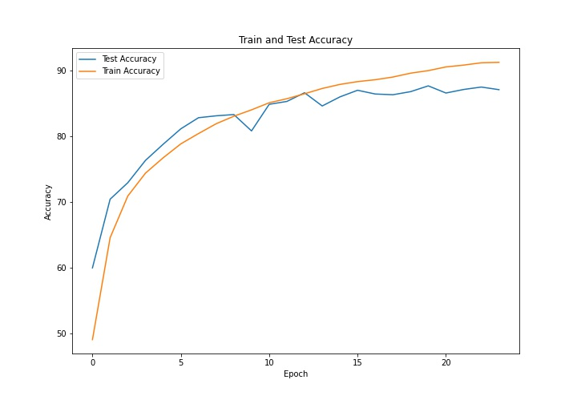
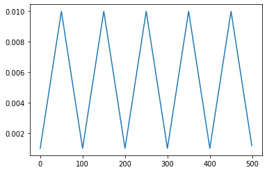

# EVA 4 
## ASSIGNMENT 11
Done by: Adithya Balakumar, Akshay VM

Target Accuracy: 90%

Using OneCycle Policy

Used this transform - RandomCrop 32, 32 (after padding of 4) >> FlipLR >> Followed by CutOut(8, 8)

## Train and Test Accuracy Plot

## Cyclic Triangular Plot

New Network:

PrepLayer - Conv 3x3 s1, p1) >> BN >> RELU [64k]
Layer1 -
X = Conv 3x3 (s1, p1) >> MaxPool2D >> BN >> RELU [128k]
R1 = ResBlock( (Conv-BN-ReLU-Conv-BN-ReLU))(X) [128k] 
Add(X, R1)
Layer 2 -
Conv 3x3 [256k]
MaxPooling2D
BN
ReLU
Layer 3 -
X = Conv 3x3 (s1, p1) >> MaxPool2D >> BN >> RELU [512k]
R2 = ResBlock( (Conv-BN-ReLU-Conv-BN-ReLU))(X) [512k]
Add(X, R2)
MaxPooling with Kernel Size 4
FC Layer 
SoftMax

